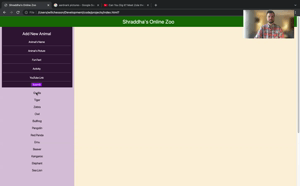

# Shraddha's Online Zoo

### Summary

This app was built for my 2.5 year old son, Shraddha, who loves animals. The app pulls from a JSON server to display a sidebar of animals, each of which when clicked displays information about that animal. Each animal display includes an embedded YouTube link. The app also has a submit feature on the sidebar that allows the user to add a new animal to the database.

### Installation

To install from the GIT server. Type the following into your terminal

git clone git@github.com:wwchesson/Zoo-app-phase-1-project.git

Don't forget to run the JSON server in order to load the animals onto the page.

### Files

There are 5 total files that comprise this app:

1. db.json
2. index.html
3. index.js
4. README.md
5. styles.css

### Additional Information

Some of the major styling components like the top navigation bar and the two main containers that comprise the page are taken from materializecss. Minor styling components are specified in the styles.css file.
